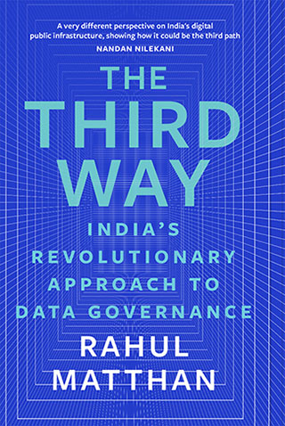

My most recent book is called The Third Way: India's Revolutionary Approach to Data Governance". It is avaialble on Amazon in [India]((https://www.amazon.in/THIRD-WAY-Revolutionary-Approach-Governance/dp/9353452635/ref=sr_1_3?crid=2E53HHL7WQIOT&keywords=the+third+way+rahul+matthan&qid=1700359825&sprefix=the+third+way,aps,212&sr=8-3)) and elsewhere around the [world](https://www.amazon.com/Third-Way-Revolutionary-Approach-Governance-ebook/dp/B0CKVZ6XPZ?crid=EY4BSYZY8V8Z&keywords=the+third+way+rahul+matthan&qid=1700359988&sprefix=the+third+way,aps,328&sr=8-1).

My other book, Privacy 3.0, is about the evolution of privacy in India and the world. You can buy a copy from Amazon in [India](https://www.amazon.in/Privacy-3-0-Unlocking-Data-Driven-Future/dp/9352779886/ref=sr_1_1?crid=2W1WT2GHXRS13&keywords=privacy+3.0&qid=1700439943&sprefix=privacy+3.0,aps,242&sr=8-1) and elsewhere around the [world](https://www.amazon.com/Privacy-3-0-Unlocking-Data-Driven-Future-ebook/dp/B07D987J5P?crid=32LSKO6BZQTW3&keywords=privacy+3.0+rahul+matthan&qid=1700440000&sprefix=privacy+3.0+rahul+mattha,aps,284&sr=8-1). I also recorded the audiobook version myself - in case you prefer listening to authors read their books to you.

